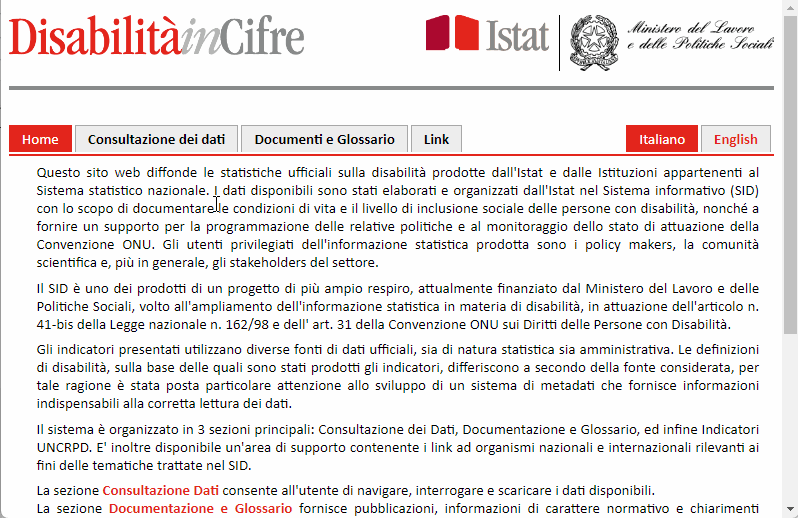

- [Introduzione](#introduzione)
- [Cambio di formato, normalizzazione e unione dei file](#cambio-di-formato-normalizzazione-e-unione-dei-file)
  - [2.csv](#2csv)
  - [4.csv](#4csv)
  - [6_01.csv](#6_01csv)
  - [6_02.csv](#6_02csv)
  - [7.csv](#7csv)

# Introduzione

I dati di [DisabilitàinCifre](https://disabilitaincifre.istat.it/) sono disponibili al download di centinaia di file `xls`. Alcune note:

- i dati per l'Italia, vanno dall'anno 2003 al 2019;
- la suddivisione territoriale più di dettaglio è quella provinciale;
- per scaricare i vari dati, bisogna applicare al click tutte le combinazioni di anni e tipologia territoriale, e poi scaricare ogni singola tavola tematica per quella coppia anno-tipoTerritorio.

In questo repo abbiamo fatto una copia di archivio di alcune delle tavole.

La selezione è stata fatta secondo questi criteri:

- partire dalla divisione per [**Territorio**](https://disabilitaincifre.istat.it/dawinciMD.jsp?a1=u2i4a94&a2=_-&n=$$$$$$$$$&o=&p=0&sp=null&l=0&exp=0);
- in questa ci sono i dati **suddivisi per anni**, in due sezioni
  - "Stati dell' Unione Europea", che non abbiamo al momento scaricato;
  - "**Amministrativa**", che contiene i dati per l'Italia.
- a partire da quest'ultima abbiamo sfogliato il sito anno per anno;
- per ogni anno, abbiamo sfogliato i dati classificati come "provinciale" e "regionale", nella sezione "Nazionale";
- e infine scaricate le tavole `xls` risultanti da questi filtri.

Qui sotto un esempio, con le tavole del 2019, nella suddivisione per provincia, che sono un totale di 8.

Questa modalità porta al *download* di **702 file**, raccolti in [questa cartella](rawdata) ed **elencati e descritti** in [questo file](anagrafica.md).

Il *download* è stato realizzato tramite questo [*script bash*](../../script/disabilita-in-cifre/download.sh).

# Cambio di formato, normalizzazione e unione dei file

Questi file scaricati da [DisabilitàinCifre](https://disabilitaincifre.istat.it/) sono stati convertiti in formato `CSV`.

In origine hanno alcuni **elementi critici** per fare **analisi di dati**, come ad esempio (vedi immagine a seguire):

1. Celle unite e riga di intestazione descrittiva (da rimuovere);
2. righe vuote (da rimuovere);
3. righe con valori aggregati.

A questo si devono aggiungere almeno un altro paio di considerazioni:

- metadati essenziali, come il taglio geografico o l'anno di riferimento, non sono leggibili come attributo correlato ai dati, ma soltanto come testo descrittivo, pensato per essere letto a schermo;
- per le classificazioni territoriali, per i nomi di province e regioni, non sono usati dei codici standard (come i codici Istat territoriali o i NUTS), ma i nomi dei luoghi. Questo rende difficile l'interoperabilità con altri dati.

I 3 punti di sopra sono stati (ove possibile) risolti tutti.

Infine, a partire dai circa 600 file originali, ne sono stati **creati 5**, mettendo insieme tutti quelli con la stessa struttura. 
A seguire i dettagli

## 2.csv

Si tratta di informazioni relative a diverse categorie tematiche, con due campi di base: il territorio di riferimento e il valore relativo rilevato.

[**`2.csv`**](../../data/disabilita-in-cifre/processing/2.csv) è il file più grande, composto da circa 20.000 righe. Qui sotto 5 righe di esempio.

| file | territorio | valore | descrizione | anno | gerarchia |
| --- | --- | --- | --- | --- | --- |
| g1UJ090NT09OG20000 | Piemonte | 3415474.72 | Importo lordo annuale dei redditi pensionistici per le persone con disabilità  (valori per mille) | 2003 | regionale |
| g1UJ090NT09OG20000 | Valle d'Aosta / Vallée d'Aoste | 154100 | Importo lordo annuale dei redditi pensionistici per le persone con disabilità  (valori per mille) | 2003 | regionale |
| g1UJ090NT09OG20000 | Liguria | 1970299.9600000002 | Importo lordo annuale dei redditi pensionistici per le persone con disabilità  (valori per mille) | 2003 | regionale |
| g1UJ090NT09OG20000 | Lombardia | 5979512.62 | Importo lordo annuale dei redditi pensionistici per le persone con disabilità  (valori per mille) | 2003 | regionale |
| g1UJ090NT09OG20000 | Trentino Alto Adige / Südtirol | 626960.03 | Importo lordo annuale dei redditi pensionistici per le persone con disabilità  (valori per mille) | 2003 | regionale |

Questi i campi:

- `file`, il nome del file da cui sono stati estratti i dati;
- `territorio`, il territorio di riferimento per quella riga (possono essere o regioni o province);
- `valore`, il valore misurato;
- `descrizione`, la descrizione del file;
- `anno`, l'anno di riferimento
- `gerarchia`, e la gerarchia territoriale, ovvero regionale o provinciale.

## 4.csv

Si tratta di informazioni relative alle **spese dei Comuni**, per assistenza domiciliare, interventi e servizi sociali e strutture residenziali.

Il file [**`4.csv`**](../../data/disabilita-in-cifre/processing/4.csv) ha questo contenuto di esempio:

| file | Regione | Disabilità | Anziani | Totale | descrizione | anno | gerarchia |
| --- | --- | --- | --- | --- | --- | --- | --- |
| g1UO0919Q09OG2000000 | Abruzzo | 2611.0299999999997 | 1295.8200000000002 | 1579.45 | Spesa dei Comuni per assistenza domiciliare per area utenza (valori medi per utente in euro correnti) | 2008 | regionale |
| g1UO0919Q09OG2000000 | Basilicata | 3920.1400000000003 | 1936.86 | 2483.5299999999997 | Spesa dei Comuni per assistenza domiciliare per area utenza (valori medi per utente in euro correnti) | 2008 | regionale |
| g1UO0919Q09OG2000000 | Calabria | 1236.8899999999999 | 623.27 | 721.5899999999999 | Spesa dei Comuni per assistenza domiciliare per area utenza (valori medi per utente in euro correnti) | 2008 | regionale |
| g1UO0919Q09OG2000000 | Campania | 2458.66 | 1416.48 | 1631.54 | Spesa dei Comuni per assistenza domiciliare per area utenza (valori medi per utente in euro correnti) | 2008 | regionale |
| g1UO0919Q09OG2000000 | Emilia-Romagna | 2357.96 | 1658.7099999999998 | 1720.9599999999998 | Spesa dei Comuni per assistenza domiciliare per area utenza (valori medi per utente in euro correnti) | 2008 | regionale |

Questi i campi:

- `file`, il nome del file da cui sono stati estratti i dati;
- `Regione`, con la regione di riferimento;
- `Disabilità`, con i valori di spesa per questa categoria, così come nel campo `descrizione`;
- `Anziani`, con i valori di spesa per questa categoria, così come nel campo `descrizione`;
- `Totale`, con i valori di spesa per questa categoria, così come nel campo `descrizione`;
- `descrizione`, la descrizione del file;
- `anno`, l'anno di riferimento
- `gerarchia`, e la gerarchia territoriale, ovvero regionale o provinciale.

## 6_01.csv

Si tratta di informazioni relative al **numero di persone**, per **gravità di limitazione**.

Il file [**`6_01.csv`**](../../data/disabilita-in-cifre/processing/6_01.csv) ha questo contenuto di esempio:

| file | scelta | Limitazioni gravi | Limitazioni non gravi | Senza limitazioni | Non indicato | descrizione | anno | gerarchia |
| --- | --- | --- | --- | --- | --- | --- | --- | --- |
| g1UP0926R09OG2000000 | Piemonte | 189 | 673 | 3229 | 284 | a.1 Persone per gravità delle limitazioni nelle attività abitualmente svolte (valori assoluti in migliaia) | 2009 | regionale |
| g1UP0926R09OG2000000 | Valle d'Aosta / Vallée d'Aoste | 6 | 20 | 87 | 12 | a.1 Persone per gravità delle limitazioni nelle attività abitualmente svolte (valori assoluti in migliaia) | 2009 | regionale |
| g1UP0926R09OG2000000 | Liguria | 89 | 251 | 1142 | 117 | a.1 Persone per gravità delle limitazioni nelle attività abitualmente svolte (valori assoluti in migliaia) | 2009 | regionale |
| g1UP0926R09OG2000000 | Lombardia | 427 | 1423 | 6963 | 810 | a.1 Persone per gravità delle limitazioni nelle attività abitualmente svolte (valori assoluti in migliaia) | 2009 | regionale |
| g1UP0926R09OG2000000 | Trentino Alto Adige / Südtirol | 39 | 145 | 711 | 107 | a.1 Persone per gravità delle limitazioni nelle attività abitualmente svolte (valori assoluti in migliaia) | 2009 | regionale |

Questi i campi:

- `file`, il nome del file da cui sono stati estratti i dati;
- `scelta`, il parametro rispetto a cui sono espressi i valori misurati, da mettere in relazione con la `descrizione`;
- `Limitazioni gravi`, con il numero di persone per questa categoria, così come nel campo `descrizione`;
- `Limitazioni non gravi`, con il numero di persone per questa categoria, così come nel campo `descrizione`;
- `Senza limitazioni`, con il numero di persone per questa categoria, così come nel campo `descrizione`;
- `Non indicato`, con il numero di persone per questa categoria, così come nel campo `descrizione`;
- `descrizione`, la descrizione del file;
- `anno`, l'anno di riferimento
- `gerarchia`, e la gerarchia territoriale, ovvero regionale o provinciale.

## 6_02.csv

Si tratta di informazioni relative al **numero di scuole** con **alunne/i con disabilità** e per **caratteristiche di edificio scolastico**.

Il file [**`6_02.csv`**](../../data/disabilita-in-cifre/processing/6_02.csv) ha questo contenuto di esempio:

| file | scelta | Infanzia | Primaria | Secondaria primo grado | Secondaria secondo grado | Totale | descrizione | anno | gerarchia |
| --- | --- | --- | --- | --- | --- | --- | --- | --- | --- |
| g1UQ091LP09OG200000000 | Presenza | # | 67.4 | 73.6 | # | 69.3 | Numero scuole con alunni con disabilità per presenza postazioni informatiche adattate (Valori percentuali) | 2010 | regionale |
| g1UQ091LP09OG200000000 | Assenza | # | 26.9 | 20.3 | # | 24.9 | Numero scuole con alunni con disabilità per presenza postazioni informatiche adattate (Valori percentuali) | 2010 | regionale |
| g1UQ091LP09OG200000000 | Non risponde | # | 5.7 | 6 | # | 5.8 | Numero scuole con alunni con disabilità per presenza postazioni informatiche adattate (Valori percentuali) | 2010 | regionale |
| g1UQ091M909OG200000000 | Presenza | # | 58.2 | 67.3 | # | 60.6 | Numero scuole per caratteristiche edificio scolastico (Valori percentuali) | 2010 | regionale |
| g1UQ091M909OG200000000 | Assenza | # | 28.8 | 25.3 | # | 27.9 | Numero scuole per caratteristiche edificio scolastico (Valori percentuali) | 2010 | regionale |

Questi i campi:

- `file`, il nome del file da cui sono stati estratti i dati;
- `scelta`, il parametro rispetto a cui sono espressi i valori misurati, da mettere in relazione con la `descrizione`;
- `Infanzia`, con il numero di scuole in percentuale per questa categoria, così come nel campo `descrizione`;
- `Primaria`, con il numero di scuole in percentuale per questa categoria, così come nel campo `descrizione`;
- `Secondaria primo grado`, con il numero di scuole in percentuale per questa categoria, così come nel campo `descrizione`;
- `Secondaria secondo grado`, con il numero di scuole in percentuale per questa categoria, così come nel campo `descrizione`;
- `Totale`;
- `descrizione`, la descrizione del file;
- `anno`, l'anno di riferimento
- `gerarchia`, e la gerarchia territoriale, ovvero regionale o provinciale.

## 7.csv

Si tratta di informazioni relative ai **posti letto** nei **presidi residenziali socio-assistenziali** e **socio-sanitari**.

Il file [**`7.csv`**](../../data/disabilita-in-cifre/processing/7.csv) ha questo contenuto di esempio:

| file | regione | Minori (0-17 anni) | Anziani (65 anni e più) | Persone con disabilità | Ospiti con problemi di salute mentale | Altra utenza | Non indicato | descrizione | anno | gerarchia |
| --- | --- | --- | --- | --- | --- | --- | --- | --- | --- | --- |
| g1UP091FC09OG2000000 | Piemonte | 1225 | 37233 | 3283 | 246 | 1410 | 89 | Posti letto nei presidi residenziali socio-assistenziali e socio-sanitari per target di utenza prevalente (valori assoluti) | 2009 | regionale |
| g1UP091FC09OG2000000 | Valle d'Aosta / Vallée d'Aoste | 17 | 1053 | 14 | 57 | 134 | 0 | Posti letto nei presidi residenziali socio-assistenziali e socio-sanitari per target di utenza prevalente (valori assoluti) | 2009 | regionale |
| g1UP091FC09OG2000000 | Liguria | 778 | 12740 | 1460 | 1023 | 398 | 0 | Posti letto nei presidi residenziali socio-assistenziali e socio-sanitari per target di utenza prevalente (valori assoluti) | 2009 | regionale |
| g1UP091FC09OG2000000 | Lombardia | 3369 | 80674 | 8267 | 4342 | 9024 | 0 | Posti letto nei presidi residenziali socio-assistenziali e socio-sanitari per target di utenza prevalente (valori assoluti) | 2009 | regionale |
| g1UP091FC09OG2000000 | Trentino Alto Adige / Südtirol | 474 | 8637 | 887 | 499 | 2235 | 0 | Posti letto nei presidi residenziali socio-assistenziali e socio-sanitari per target di utenza prevalente (valori assoluti) | 2009 | regionale |

Questi i campi:

- `file`, il nome del file da cui sono stati estratti i dati;
- `regione`, la regione di riferimento
- `Minori (0-17 anni)`, numero di posti letto per questa categoria;
- `Anziani (65 anni e più)`, numero di posti letto per questa categoria;
- `Persone con disabilità`, numero di posti letto per questa categoria;
- `Ospiti con problemi di salute mentale`, numero di posti letto per questa categoria;
- `Altra utenza`, numero di posti letto per questa categoria;
- `Non indicato`, numero di posti letto per questa categoria;
- `descrizione`, la descrizione del file;
- `anno`, l'anno di riferimento
- `gerarchia`, e la gerarchia territoriale, ovvero regionale o provinciale.
